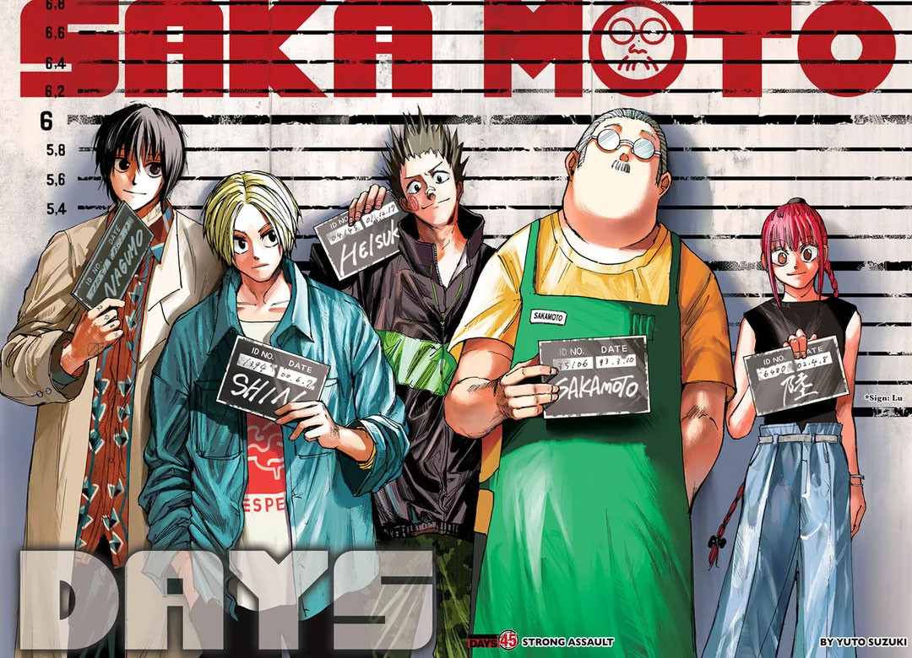

# HW#2 - Sakamoto Days character build using CSS

This repo contains the HW#2 about the Character Build of Sakamoto Days using CSS selection and styles.
## Installation 
No installation required. Simply download the zip file and extract
## Usage 
Open index.html in the browser of your choice
## Contributing
1. Fork it!
2. Create your feature branch: `git checkout -b my-new-feature`
3. Commit your changes: `git commit -am 'Add some feature'`
4. Push to the branch: `git push origin my-new-feature`
5. Submit a pull request :D
## History 
TODO: Write history
## Credits
- Jordan Chuquillanqui
## License
MIT